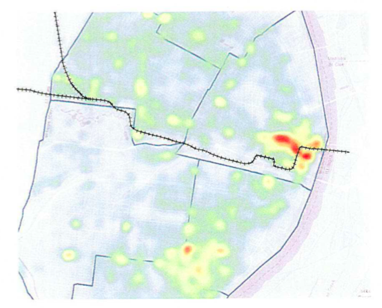
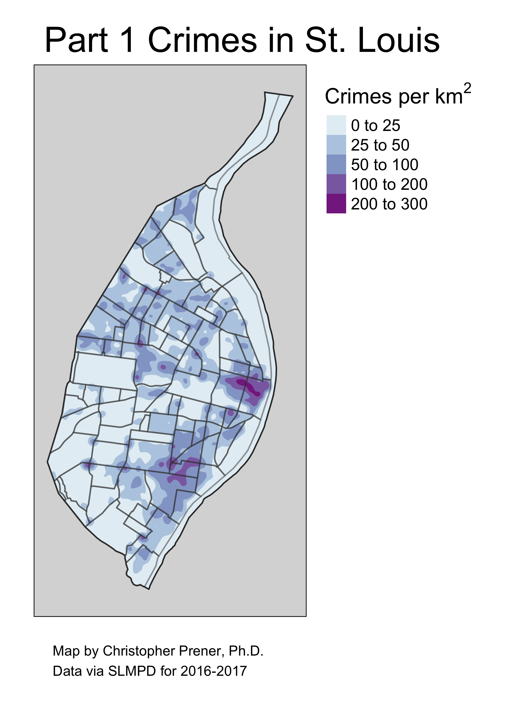
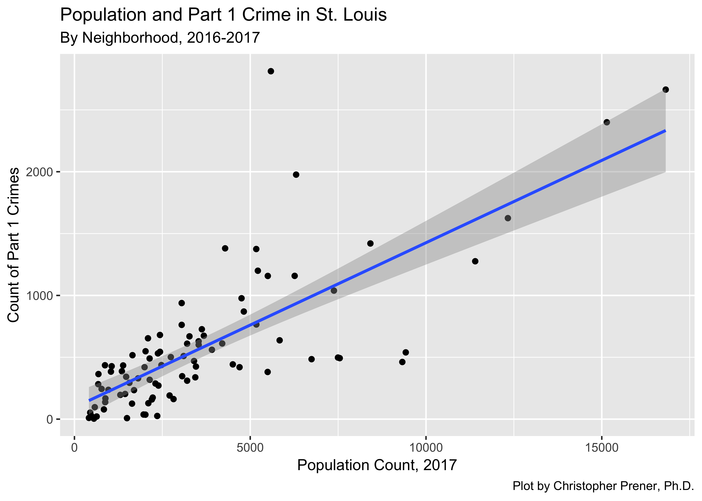
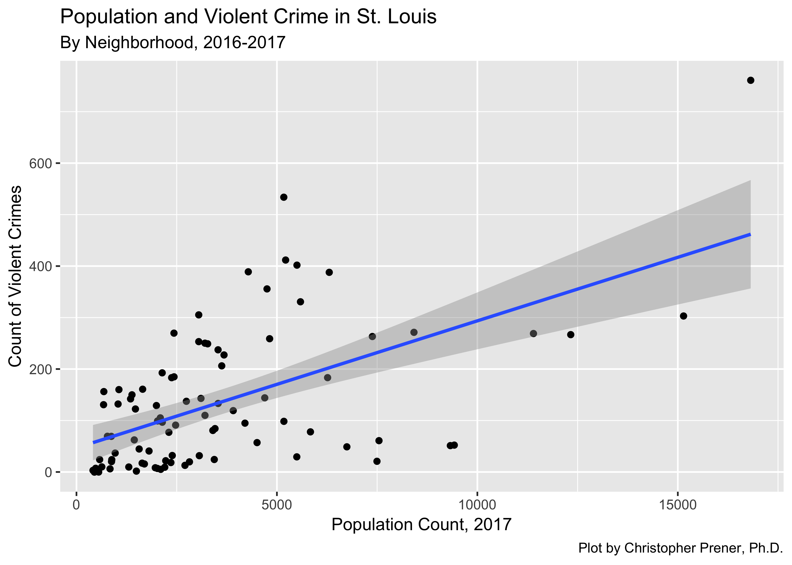
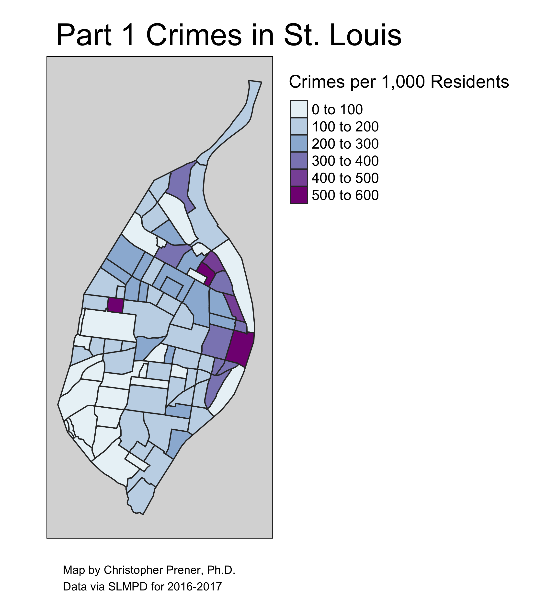
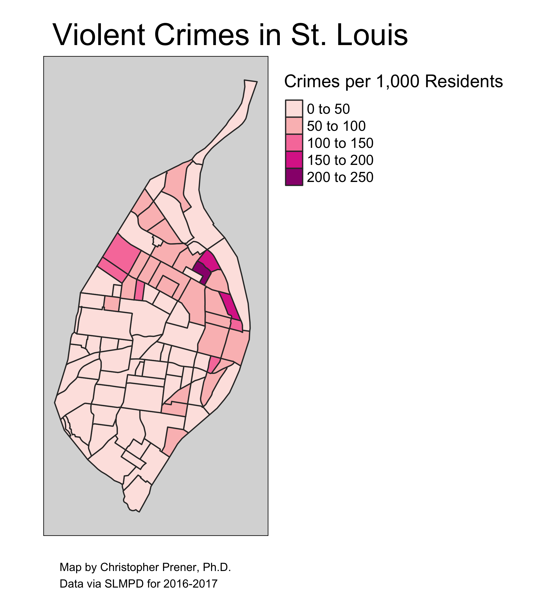

+++
# Project title.
title = "Violent Crime in St. Louis"

# Date this page was created.
date = 2018-12-09T00:00:00

# Project summary to display on homepage.
summary = "Replicating a map from the Belmar Plan."

# Tags: can be used for filtering projects.
# Example: `tags = ["machine-learning", "deep-learning"]`
tags = ["StLouis", "GIS", "Crime"]

# Optional external URL for project (replaces project detail page).
external_link = ""

# Slides (optional).
#   Associate this project with Markdown slides.
#   Simply enter your slide deck's filename without extension.
#   E.g. `slides = "example-slides"` references 
#   `content/slides/example-slides.md`.
#   Otherwise, set `slides = ""`.
slides = ""

# Links (optional).
url_pdf = ""
url_slides = ""
url_video = ""
url_code = ""

# Custom links (optional).
#   Uncomment line below to enable. For multiple links, use the form `[{...}, {...}, {...}]`.
url_custom = [{icon_pack = "fab", icon="github", name="Data & Code", url = "https://github.com/chris-prener/STL_CRIME_Belmar"}, {icon_pack = "fab", icon="twitter", name="Tweet", url = "https://twitter.com/chrisprener/status/1071078021690474496"}]

# Featured image
# To use, add an image named `featured.jpg/png` to your project's folder. 
[image]
  # Caption (optional)
  caption = "Violent Crime Density, St. Louis"
  
  # Focal point (optional)
  # Options: Smart, Center, TopLeft, Top, TopRight, Left, Right, BottomLeft, Bottom, BottomRight
  focal_point = "Smart"
+++

When Chief Belmar's [proposal](https://bloximages.newyork1.vip.townnews.com/stltoday.com/content/tncms/assets/v3/editorial/8/42/8423788c-c647-54dc-89c9-db985e6e77ce/5c3028f56c8fe.pdf.pdf) for consolidating the City and County police departments was [released to the media](https://www.stltoday.com/news/local/crime-and-courts/st-louis-county-police-chief-proposes-merger-with-st-louis/article_d3ffb36f-fa7f-553b-93f4-ea6c6f0203af.html), one page happened to catch my eye. It had two kernal density maps of Part 1 crimes, which are defined by the FBI as all violent crimes (aggravated assault, rape, murder, and robbery) as well as property crimes (arson, burglary, larceny-theft, and motor vehicle theft).

As you can see, the map quality was poor and it lacked a legend (or even a description of what Part 1 crimes are). It also leaves viewers with the strong impression that crime is focused on Downtown. This supports the report's argument that policing resources need to be focused on two areas, Downtown and the Central West End. The report makes no mention of the hotspot in South City. The map was also focusedon the city's midsection, cutting off both North and South City.

## Recreating the Density Maps
As an exercise in using some new mapping software, I decided to recreate these maps. First up with my attempt to recreate the original map in the Belmar report. 

The map is not fundamentally different, though I would argue it is easier to read and provides more context (i.e. a legend and clear breaks between the different colors on the map). We still see noticiable clusters over Downtown and in South City.

I do think, however, the select of Part 1 Crimes was done for a specific reason. If you map violent crime (aggravated assault, rape, murder, and robbery), the conclusion you would come to about Downtown is slightly different.

In terms of violent crime, the Downtown area of St. Louis no longer makes a significant impression relative to the rest of North City. To be sure, violent crime remains a concern in Downtown St. Louis, it just isn't as remarkable.

## Crime is (in Part) a Function of Population Density
Another thing wholly absent from the Belmar Proposal is that crime is, in part, influenced by population density. We expect more crime to exist in areas where there are more people. We can see this pretty clearly in St. Louis for both part 1 and violent crimes:

Given this relationship, it is important to look at crime *rates* as opposed to the volume of crime in a given area. 

## Mapping Crime Rates in St. Louis
To get a sense about whether crime appears high in Downtown St. Louis because it is one of the more densly populated areas of the city, I've mapped Part 1 crime *rates* per 1,000 individuals. To get there, I divide the total number of crimes by the total number of esimtated people living in each neighborhood, and then multiply by 1,000. 

Once we factor in population density, we see that while Downtown remains a significant focal point for crime, there are areas both north and south of Downtown (as well as north of Forest Park) that also have high crime rates, but are not emphasized on the Belmar Proposal map. 

When we look only at violent crimes, the argument for focusing on Downtown goes away - our attention is drawn to North City as the locus for much of the violent crime in St. Louis. 

## Bottom Line
The hotspot that the Belmar proposal highlights is due to property crimes like larcency and motor vehicle theft, rather than violent crimes. At no point is there a significant volumne of crime in the Central West End, which was the other neighborhood highlighted in Belmar's proposal. In fact, a good argument could be made that policing resources are most needed in the areas of the city no emphasized in the report at all.
