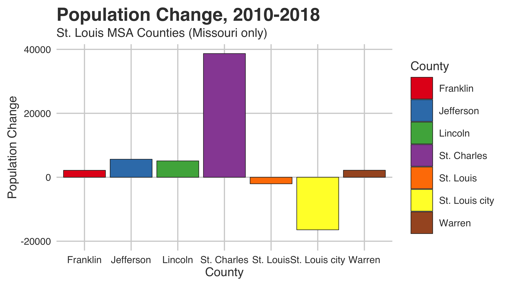
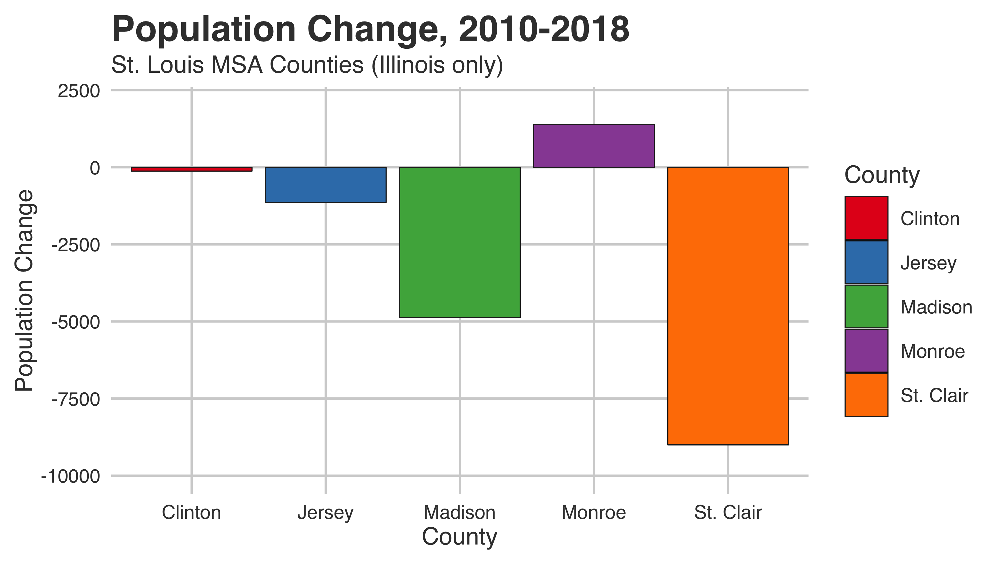
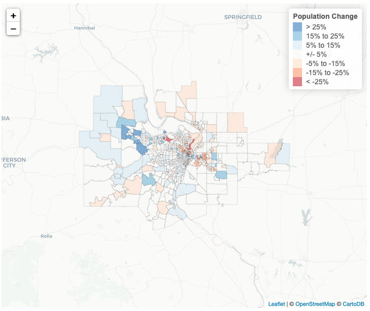

+++
# Project title.
title = "St. Louis Metro Population Change"

# Date this page was created.
date = 2019-04-19T00:00:00

# Project summary to display on homepage.
summary = "Population changes by Census tract, 2010 to 2017."

# Tags: can be used for filtering projects.
# Example: `tags = ["machine-learning", "deep-learning"]`
tags = ["StLouis", "GIS", "Demography"]

# Optional external URL for project (replaces project detail page).
external_link = ""

# Slides (optional).
#   Associate this project with Markdown slides.
#   Simply enter your slide deck's filename without extension.
#   E.g. `slides = "example-slides"` references 
#   `content/slides/example-slides.md`.
#   Otherwise, set `slides = ""`.
slides = ""

# Links (optional).
url_pdf = ""
url_slides = ""
url_video = ""
url_code = ""

# Custom links (optional).
#   Uncomment line below to enable. For multiple links, use the form `[{...}, {...}, {...}]`.
# url_custom = [{icon_pack = "fas", icon="download", name="Download", url = "https://chris-prener.github.io/dataviz/project/stl-pop-change/nhoodChange.png"}, {icon_pack = "fab", icon="github", name="Data & Code", url = "https://github.com/chris-prener/STL_DEMOGRAPHY_NhoodChange"}, {icon_pack = "fab", icon="twitter", name="Tweet", url = "https://twitter.com/chrisprener/status/1071078021690474496"}]

# Featured image
# To use, add an image named `featured.jpg/png` to your project's folder. 
[image]
  # Caption (optional)
  caption = "St. Louis County and St. Louis City Census Tracts)"
  
  # Focal point (optional)
  # Options: Smart, Center, TopLeft, Top, TopRight, Left, Right, BottomLeft, Bottom, BottomRight
  focal_point = "Smart"
+++

One of the questions the Post-Dispatch's [Janelle O'Day](https://www.stltoday.com/users/profile/jodea/) asked me during our conversation about the latest [Census Bureau numbers](https://www.stltoday.com/news/local/metro/census-st-louis-city-lost-st-charles-county-gained-and/article_738cfe8f-a15e-5da8-9ad7-a38d8027ea71.html) for St. Louis yesterday had to do with where we'd expect to see declines and increases in population within counties. 

For a quick recap, here are two plots summarizing county-level population change from 2010 to 2018 (using yesterday's released estimates):

 

We've seen continued declines in St. Louis City, St. Clair county, and Madison county in particular along with stagnant growth in St. Louis county. Where we've seen substantial growth is in exurban parts of Metro West, especially St. Charles county.

To give us some data on sub-county changes in advance of this December's updates to the American Community Survey, I calculated percent change at the Census tract level for every tract in the St. Louis metro area.

So where might we anticipate to see continued declines come December when the 2018 ACS is released? North City, North St. Louis County, and the core of St. Clair county are all good bets for parts of the region that we should expect to see continued sub-county population declines in. For growth, look to the western part of St. Charles county in particular, as well as those ex-urban tracts in Metro West. 

You can view an interactive version of the map [here](https://chris-prener.github.io/dataviz/post/popchange/).

